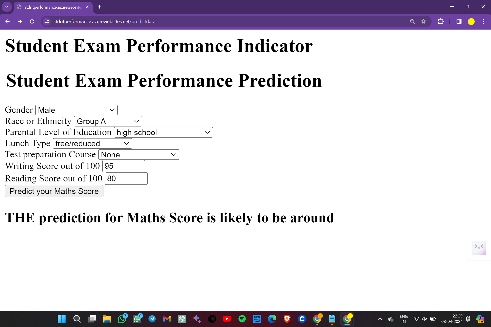
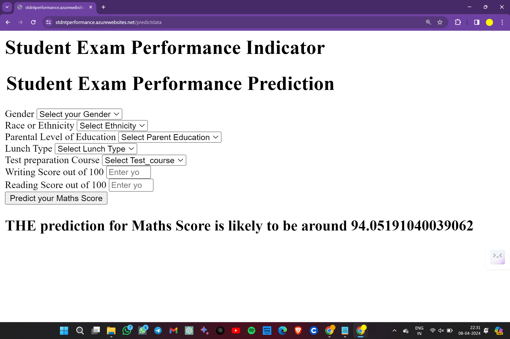

# End to End ML (Machine Learning) Project

## Prediction of Students Performance in Exams

### Introduction About the Data :

**The dataset** The goal is to predict `Maths Score` of a given student provided various features (Regression Analysis).

There are 7 features:

* `gender` : 
* `race_ethnicity` : 
* `parental_level_of_education` : 
* `lunch` : 
* `test_preparation_course` : 
* `reading_score` : 
* `writing_score` : 

Target variable:
* `Maths Score`: Price of the given Diamond.

Kaggle Dataset Source Link :
[https://www.kaggle.com/datasets/spscientist/students-performance-in-exams/data]

# Approach for the project 

1. Data Ingestion : 
    * In Data Ingestion phase the data is first read as csv. 
    * Then the data is split into training and testing and saved as csv file.

2. Data Transformation : 
    * In this phase a ColumnTransformer Pipeline is created.
    * for Numeric Variables first SimpleImputer is applied with strategy median , then Standard Scaling is performed on numeric data.
    * for Categorical Variables SimpleImputer is applied with most frequent strategy, then ordinal encoding performed , after this data is scaled with Standard Scaler.
    * This preprocessor is saved as pickle file.

3. Model Training : 
    * In this phase base model is tested for `RandomForestRegressor`,`DecisionTreeRegressor`,`GradientBoostingRegressor`,`LinearRegression`,`XGBRegressor`,
    `CatBoostRegressor`, and `AdaBoostRegressor`. 
    The best model found was Linear Regression.
    * After this hyperparameter tuning is performed on each of the models, again the best model found was Linear Regression.
    * A final Regressor is created for `Linear Regression`.
    * This model is saved as `pickle` file.

4. Prediction Pipeline : 
    * This pipeline converts given data into dataframe and has various functions to load pickle files and predict the final results in python.

5. Flask App creation : 
    * Flask app is created with User Interface to predict the Student's Performance on Math Score inside a Web Application.

## Exploratory Data Analysis Notebook

Link : [EDA Notebook](./notebook/1_EDA_STUDENT_PERFORMANCE.ipynb)

## Model Training Approach Notebook

Link : [Model Training Notebook](./notebook/2_MODEL_TRAINING.ipynb)

# Microsoft Azure Deployment using Github Actions:

Microsoft Azure link : [https://stdntperformance.azurewebsites.net/predictdata]

# Screenshot of UI
Filling features in the Homepage

### Predcted Maths Score :

